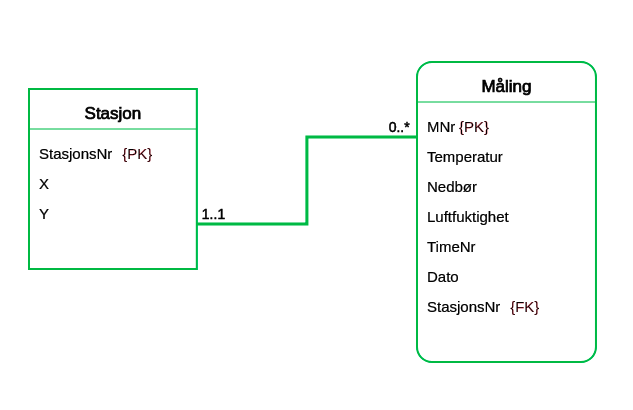
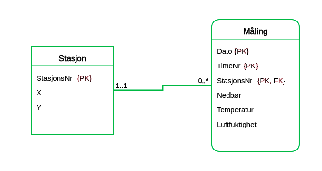

### LearnER

1.  

2.  Gjør oppgaven «Værstasjoner». Nå får du ikke like mye hjelp til hvordan den skal løses.  

    ```
    Meteorologisk institutt har værstasjoner plassert rundt om i hele landet.

    Koordinatene til hver enkelt stasjon skal lagres. Dessuten har hver stasjon et unikt stasjonsnummer.

    Værstasjonene måler samlet nedbør, gjennomsnittlig temperatur og gjennomsnittlig luftfuktighet hver time. Hver måling blir tildelt et unikt målingsnummer.

    Data fra stasjonene blir overført til en sentral database for analyse.
    ```

    

3.  Gjør oppgaven «Værstasjoner -variant».  
    Skjønte du forskjellen mellom de to værstasjonoppgavene?  

    ```
    Løs oppgaven Værstasjoner først, dette er en variant.

    Meteorologisk institutt har værstasjoner plassert rundt om i hele landet.

    Koordinatene til hver enkelt stasjon skal lagres. Dessuten har hver stasjon et unikt stasjonsnummer.

    Værstasjonene måler samlet nedbør, gjennomsnittlig temperatur og gjennomsnittlig luftfuktighet hver time.

    Data fra stasjonene blir overført til en sentral database for analyse.

    Det nye i denne varianten av oppgaven er at du ikke har tilgang på MNr (målingsnummer).
    ```

      

    - Forskjellen mellom oppgavene er 

---

### Modellering i praksis: database for nettbutikk

1.  De skal lagre kundedata i databasen, så de lett kan sende ut reklame, samt at kundene skal
slippe å taste inn alt av personalia hver gang de handler. På grunn av dette skal kundene ha
en unik kundeid, samt mulighet for å lagre navn og en adresse.
2.  Kundene skal kunne lagre telefonnummer så de kan ringes opp igjen ved leveranseproblemer
e.l. Hver kunde skal kunne ha flere telefonnummer. (Men det er også lov å ikke registrere
telefon i det hele tatt.)
3.  Varene skal ligge inne med id, navn og pris. Bok Handel AS selger i første omgang kun
nedlastbare produkter, så det er ingen grunn til å holde styr på lagerbeholdning: Siden
varene kun lastes ned, kan alle varer de fører selges uendelig mange ganger.
(Smart, ikke sant? Det synes i alle fall Bok Handel AS.)
4.  Kundenes ordrer skal også registreres i databasen. Hver kunde kan registrere så mange
ordre han eller hun ønsker. Ordren skal inneholde en unik ordreid og dato for når den ble
opprettet.
5.  Vanskelig: Hver ordre kan inneholde så mange forskjellige varer som kunden ønsker, og så
mange eksemplarer av hver vare som kunden ønsker (begrenset innenfor rimelighetens
grenser - maks på noen hundre eller noen tusen er ok). Siden varene finnes i uendelig antall
kan hver vare dermed også forekomme på mange ordre.

Resultat:


SQL script: [nettbutikk](nettbutikk.sql)

```sql
-- MySQL Script generated by MySQL Workbench
-- Sat 16 Oct 2021 01:36:34 AM CEST
-- Model: New Model    Version: 1.0
-- MySQL Workbench Forward Engineering

SET @OLD_UNIQUE_CHECKS=@@UNIQUE_CHECKS, UNIQUE_CHECKS=0;
SET @OLD_FOREIGN_KEY_CHECKS=@@FOREIGN_KEY_CHECKS, FOREIGN_KEY_CHECKS=0;
SET @OLD_SQL_MODE=@@SQL_MODE, SQL_MODE='ONLY_FULL_GROUP_BY,STRICT_TRANS_TABLES,NO_ZERO_IN_DATE,NO_ZERO_DATE,ERROR_FOR_DIVISION_BY_ZERO,NO_ENGINE_SUBSTITUTION';

-- -----------------------------------------------------
-- Schema nettbutikk
-- -----------------------------------------------------

-- -----------------------------------------------------
-- Schema nettbutikk
-- -----------------------------------------------------
CREATE SCHEMA IF NOT EXISTS `nettbutikk` ;
USE `nettbutikk` ;

-- -----------------------------------------------------
-- Table `nettbutikk`.`user`
-- -----------------------------------------------------
CREATE TABLE IF NOT EXISTS `nettbutikk`.`user` (
  `userid` INT NOT NULL AUTO_INCREMENT,
  `username` VARCHAR(16) NOT NULL,
  `email` VARCHAR(255) NULL,
  `password` VARCHAR(32) NOT NULL,
  `create_time` TIMESTAMP NULL DEFAULT CURRENT_TIMESTAMP,
  `name` VARCHAR(45) NULL,
  `adress` VARCHAR(45) NULL,
  PRIMARY KEY (`userid`));


-- -----------------------------------------------------
-- Table `nettbutikk`.`number`
-- -----------------------------------------------------
CREATE TABLE IF NOT EXISTS `nettbutikk`.`number` (
  `number` INT NOT NULL,
  `user_userid` INT NOT NULL,
  PRIMARY KEY (`number`, `user_userid`),
  INDEX `fk_number_user_idx` (`user_userid` ASC) VISIBLE,
  CONSTRAINT `fk_number_user`
    FOREIGN KEY (`user_userid`)
    REFERENCES `nettbutikk`.`user` (`userid`)
    ON DELETE NO ACTION
    ON UPDATE NO ACTION)
ENGINE = InnoDB;


-- -----------------------------------------------------
-- Table `nettbutikk`.`order`
-- -----------------------------------------------------
CREATE TABLE IF NOT EXISTS `nettbutikk`.`order` (
  `orderid` INT NOT NULL AUTO_INCREMENT,
  `user_userid` INT NOT NULL,
  PRIMARY KEY (`orderid`, `user_userid`),
  INDEX `fk_order_user1_idx` (`user_userid` ASC) VISIBLE,
  CONSTRAINT `fk_order_user1`
    FOREIGN KEY (`user_userid`)
    REFERENCES `nettbutikk`.`user` (`userid`)
    ON DELETE NO ACTION
    ON UPDATE NO ACTION)
ENGINE = InnoDB;


-- -----------------------------------------------------
-- Table `nettbutikk`.`product`
-- -----------------------------------------------------
CREATE TABLE IF NOT EXISTS `nettbutikk`.`product` (
  `productid` INT NOT NULL AUTO_INCREMENT,
  `name` VARCHAR(255) NOT NULL,
  `price` INT NOT NULL,
  `amount` INT(2) NOT NULL,
  `order_orderid` INT NOT NULL,
  `order_user_userid` INT NOT NULL,
  PRIMARY KEY (`productid`),
  INDEX `fk_product_order1_idx` (`order_orderid` ASC, `order_user_userid` ASC) VISIBLE,
  CONSTRAINT `fk_product_order1`
    FOREIGN KEY (`order_orderid` , `order_user_userid`)
    REFERENCES `nettbutikk`.`order` (`orderid` , `user_userid`)
    ON DELETE NO ACTION
    ON UPDATE NO ACTION);


SET SQL_MODE=@OLD_SQL_MODE;
SET FOREIGN_KEY_CHECKS=@OLD_FOREIGN_KEY_CHECKS;
SET UNIQUE_CHECKS=@OLD_UNIQUE_CHECKS;

```