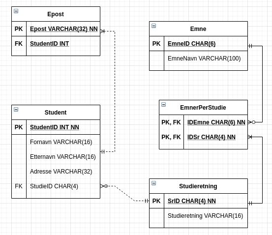

### Fra konsept til SQL

5.  Gjør om ER-modellen til en databasemodell, etter de 3 første punktene (av 6 mulige)
beskrevet i slidsene for denne økten. (Hopp over elementer du ikke klarte, og fortsett på
neste deloppgave.)

    

6.  Implementer tabellene i MySQL! (Lag en ny database/schema: hskole.)  

    ```sql
    -- MySQL Script generated by MySQL Workbench
    -- Mon 18 Oct 2021 12:41:41 AM CEST
    -- Model: New Model    Version: 1.0
    -- MySQL Workbench Forward Engineering

    SET @OLD_UNIQUE_CHECKS=@@UNIQUE_CHECKS, UNIQUE_CHECKS=0;
    SET @OLD_FOREIGN_KEY_CHECKS=@@FOREIGN_KEY_CHECKS, FOREIGN_KEY_CHECKS=0;
    SET @OLD_SQL_MODE=@@SQL_MODE, SQL_MODE='ONLY_FULL_GROUP_BY,STRICT_TRANS_TABLES,NO_ZERO_IN_DATE,NO_ZERO_DATE,ERROR_FOR_DIVISION_BY_ZERO,NO_ENGINE_SUBSTITUTION';

    -- -----------------------------------------------------
    -- Schema Høyskole
    -- -----------------------------------------------------

    -- -----------------------------------------------------
    -- Schema Høyskole
    -- -----------------------------------------------------
    CREATE SCHEMA IF NOT EXISTS `Høyskole` ;
    USE `Høyskole` ;

    -- -----------------------------------------------------
    -- Table `Høyskole`.`Studieretning`
    -- -----------------------------------------------------
    CREATE TABLE IF NOT EXISTS `Høyskole`.`Studieretning` (
    `SrID` CHAR(4) NOT NULL,
    `Studieretning` VARCHAR(32) NULL,
    PRIMARY KEY (`SrID`))
    ENGINE = InnoDB;


    -- -----------------------------------------------------
    -- Table `Høyskole`.`Student`
    -- -----------------------------------------------------
    CREATE TABLE IF NOT EXISTS `Høyskole`.`Student` (
    `StudentID` INT NOT NULL,
    `Fornavn` VARCHAR(16) NULL,
    `Etternavn` VARCHAR(16) NULL,
    `Adresse` VARCHAR(32) NULL,
    `StudieID` CHAR(4) NOT NULL,
    PRIMARY KEY (`StudentID`),
    INDEX `StudieID_idx` (`StudieID` ASC) VISIBLE,
    CONSTRAINT `StudieID`
        FOREIGN KEY (`StudieID`)
        REFERENCES `Høyskole`.`Studieretning` (`SrID`)
        ON DELETE NO ACTION
        ON UPDATE NO ACTION)
    ENGINE = InnoDB;


    -- -----------------------------------------------------
    -- Table `Høyskole`.`Epost`
    -- -----------------------------------------------------
    CREATE TABLE IF NOT EXISTS `Høyskole`.`Epost` (
    `Epost` VARCHAR(32) NOT NULL,
    `StudentID` INT NULL,
    PRIMARY KEY (`Epost`),
    INDEX `StudentID_idx` (`StudentID` ASC) VISIBLE,
    CONSTRAINT `StudentID`
        FOREIGN KEY (`StudentID`)
        REFERENCES `Høyskole`.`Student` (`StudentID`)
        ON DELETE NO ACTION
        ON UPDATE NO ACTION)
    ENGINE = InnoDB;


    -- -----------------------------------------------------
    -- Table `Høyskole`.`Emne`
    -- -----------------------------------------------------
    CREATE TABLE IF NOT EXISTS `Høyskole`.`Emne` (
    `EmneID` CHAR(6) NOT NULL,
    `EmneNavn` VARCHAR(100) NULL,
    PRIMARY KEY (`EmneID`))
    ENGINE = InnoDB;


    -- -----------------------------------------------------
    -- Table `Høyskole`.`EmnerPerStudie`
    -- -----------------------------------------------------
    CREATE TABLE IF NOT EXISTS `Høyskole`.`EmnerPerStudie` (
    `IDEmne` CHAR(6) NOT NULL,
    `IDSr` CHAR(4) NOT NULL,
    PRIMARY KEY (`IDEmne`, `IDSr`),
    INDEX `IDSr_idx` (`IDSr` ASC) VISIBLE,
    CONSTRAINT `IDEmne`
        FOREIGN KEY (`IDEmne`)
        REFERENCES `Høyskole`.`Emne` (`EmneID`)
        ON DELETE NO ACTION
        ON UPDATE NO ACTION,
    CONSTRAINT `IDSr`
        FOREIGN KEY (`IDSr`)
        REFERENCES `Høyskole`.`Studieretning` (`SrID`)
        ON DELETE NO ACTION
        ON UPDATE NO ACTION)
    ENGINE = InnoDB;


    SET SQL_MODE=@OLD_SQL_MODE;
    SET FOREIGN_KEY_CHECKS=@OLD_FOREIGN_KEY_CHECKS;
    SET UNIQUE_CHECKS=@OLD_UNIQUE_CHECKS;
    ```

7.  Registrer følgende emner - id / tittel:
    - DS1337 / Fett design
    - PG1011 / Binær programmering
    - PJ1234 / Grunnleggende prosjekt

    ```sql
    INSERT INTO Emne(EmneID, EmneNavn)
    VALUES
        ('DS1337', 'Fett design'),
        ('PG1011', 'Binær programmering'),
        ('PJ1234', 'Grunnleggende prosjekt')
    ;
    ```

8.  Registrer 2 studieretninger: Dynamisk Design og Pragmatisk Programmering.  
    Lag koplinger mellom studieretninger og emner slik at resultatet blir:
    - Ved Pragmatisk Programmering undervises det i PJ1234 og PG1011.
    - Ved Dynamisk Design undervises det i PJ1234 og DS1337.

    Legge til studieretninger:

    ```sql
    INSERT INTO Studieretning(SrID, Studieretning)
    VALUES
        ('DyDe', 'Dynamisk Design'),
        ('PrPr', 'Pragmatisk Programmering')
    ;
    ```

    Kople sammen studieretninger og emner:

    ```sql
    
    ```