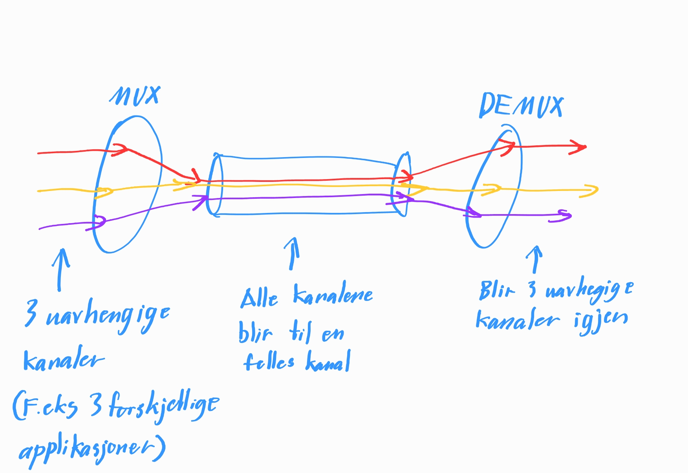
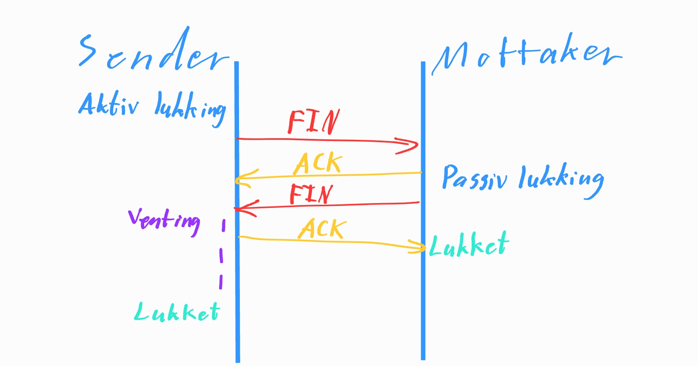

# 1. Transportlaget

## a) Kort forklart, hva er hensikten med transportlaget?

Transportlaget er for håndtering av transport av applikasjonsmeldinger mellom klient og tjener til en applikasjon. Det overføres datasekvenser av variabel lengde samtidig som kvaliteten på QoS opprettholdes.

## b) Hvilke typer protokoller brukes i transportlaget?

Det er to typer protokoller i transportlaget, [TCP](https://en.wikipedia.org/wiki/Transmission_Control_Protocol) og [UDP](https://en.wikipedia.org/wiki/User_Datagram_Protocol). TCP(Transmission Control Protocol) oppretter en fast forbindelse og legger inn flyt-kontroll, sekvens-nummer, kvittering, tidskontroll, feilsjekking og kontroll av trafikk-kork. UDP(User Diagram Protocol) sender et datagram som kan bestå av flere deler og håper på at det kommer frem, legger til også ende-til-ende kontroll og feil-sjekking. TCP blir brukt til forbindelsesorientere overføringer mens UDP blir brukt til simplere overføringer.

## c) Forklar med tegning hvordan multipleksing og demultipleksing fungerer.



## d) Hva er et portnummer, og hvilken fordel gir det oss når vi sender data fra en maskin til en annen?

Portnummer er en type ID som brukes for å si hvilken applikasjon som skal motta den. Det er en fordel når man sender data til hverandre at applikasjonen vet hvor på maskinene dataen bli sendt til og fra.

## e) Hva menes med en "trafikk-kork"?

Trafikk-kork er når det er for mange kilder som sender for mye data for fort til at de som skal transportere dataen ikke klarer å håndtere det. Som oftest skjer trafikk-kork i ruterne som skaper nettverket dataen skal transporteres på. Problemet når det er trafikk-kork er at pakker kan bli tapte eller at det blir lange forsinkelser fordi det er kø.

## f) Sett sammen protokoll med riktig port.

DNS - 53

HTTP - 80

HTTPS - 443

SMTP - 25

Secure Shell - 22

## g) Hvilken type informasjon får du frem med å kjøre disse kommandoene i terminalen:

-   netstat -help

    Når du kjører `netstat -help` får du informasjon om netstat kommandoen og liste over parametre for kommandoen.

-   netstat -a

    Når du kjører `netstat -a` vil den vise alle aktive koblinger og TCP og UDP porter som datamaskiner lytter til.

-   netstat -n

    Når du kjører `netstat -n` vil den vise alle aktive TCP koblinger men adresser og port nummer er numerisk og vil ikke prøve å vise navn på koblingene.

# UDP

## a) Skriv 150-250 ord om UDP, hva er det? Hva brukes det til? Hva er bra/dårlig med UDP? Hvordan oppdager man feil i UDP protokollen?

UDP er en nettverksprotokoll for forbindelsesløs overføring av data som er brukt på transportlaget. UDP brukes til raske overføringer ettersom det ikke sjekker om dataene kommer fram sånn at det ikke blir brukt ekstra til på å sjekke om det har kommet fram. Ulempen med UDP er at det har ingen form for levering eller duplikatbeskyttelse. Så dermed kan det bli pakker blir droppet og må sendes på nytt. Men fordelen med UDP er at det blir raske overføringer fordi det trenger ikke extra prosessering for feilkontroll og feilretting. UDP bruker sjekksummer for dataintegritet for å sjekke at dataen er riktig når den ankommer. Hvis dataen ikke kommer fram eller at dataen ikke er riktig, vil dataen bli sendt på nytt.

## b) Fyll i UDP headern

| 32 bits       |             |
| ------------- | ----------- |
| source port # | dest port # |
| length        | checksum    |

## c) Om vi regner på en UDP sjekksum, ville ha disse pakkene inneholde feil? Hint: se slideserie for å finne ut hvordan du skal regne dette, husk "wrap around"

```
Pakke 1

Data:
1010 0110 1010 1101
1101 0010 0011 1010
1000 1011 0100 1001

Sjekksum:
1101 1011 1100 1011
```

Pakke 1 blir feil fordi svaret ikke blir `1111 1111 1111 1111`.

```
Pakke 2

Data:
1010 1110 1010 1001
0010 1011 1001 0101
1100 1010 0110 0101

Sjekksum:
0101 1011 0101 1011
```

Pakke 2 blir OK fordi svaret ved å addere alle binære tall inkludert sjekksummen blir `1111 1111 1111 1111`.

# TCP

## a) Hvorfor brukes det mer TCP enn UDP i dag?

Fordi TCP er mer pålitelig fordi det er en sikker forbindelse mellom avsender og mottaker gjennom en handshake. Så man kan stole på at all data som blir sendt gjennom TCP kommer frem til mottaker. TCP har også mulighet for "full duplex", som betyr at både sender og mottaker kan sende data samtidig.

## b) På hvilken måte blir TCP pålitelig?

Fordi det blir opprettet en forbindelse mellom en avsender og en mottaker, og bruker bytestream som er at bytes som ankommer motakkers kanal er helt lik som senderen sendte og blir mottatt i akkuratt samme rekkefølge som senderen sendte det i.

TCP har også flyt-(forhindre at sender sender data for fort til at mottaker kan pålitelig motta og behandle det) og metnings-kontroll(forhindrer at nettverketsytelse faller drastisk pga. trafikkork) som bestemmer vindu-størrelse(hvor mye data TCP kan sende i et segment). Har også buffer for avsender og motakker. TCP har også muligheten til å bruke duplex data som vil si at begge endene kan sende og motta data samtidig. TCP er forbindelses-orientert som vil si at det blir gjort en handshake(opprette en kobling) før dataoverføring.

Så TCP bruker mange operasjoner for å sikre pålitelig dataoverføring.

## c) Hvordan håndterer TCP problem som oppstår?

TCP hånterer problemer ved hjelp av sjekksum(bitfeil i mottatt pakke), kvittering(bitfeil på linje), sekvensnummer(feil i kvitteringsmeldinger eller duplikater) og timer(tap av pakker).

## d) Er TCP sin header større eller mindre enn UDP sin header

TCP sin header er større fordi TCP inneholder:

-   Senderport
-   Mottakkerport
-   Sekvensnummer
-   Kvitteringsnummer
-   U, A, P, R, S, F
-   Mottagervindu
-   Sjekksum
-   Urg data peker
-   Alternativer

Mens UDP sin header inneholder:

-   Avsender port
-   Mottaker port
-   UDP lengde
-   UDP sjekksum

## e) Tegn opp en nedkobling av en TCP-forbindelse.



## f) Hva menes med TCP og rettferdighet?

TCP rettferdighet er å ha rettferdig deling av linkhastigheten.
