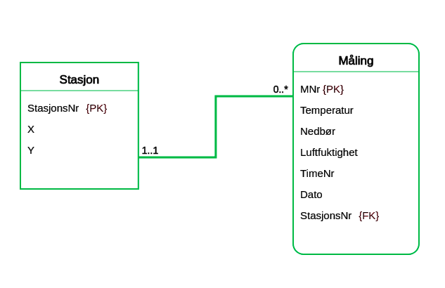

### LearnER

1.  

2.  Gjør oppgaven «Værstasjoner». Nå får du ikke like mye hjelp til hvordan den skal løses.  

    ```
    Meteorologisk institutt har værstasjoner plassert rundt om i hele landet.

    Koordinatene til hver enkelt stasjon skal lagres. Dessuten har hver stasjon et unikt stasjonsnummer.

    Værstasjonene måler samlet nedbør, gjennomsnittlig temperatur og gjennomsnittlig luftfuktighet hver time. Hver måling blir tildelt et unikt målingsnummer.

    Data fra stasjonene blir overført til en sentral database for analyse.
    ```

    

3.  Gjør oppgaven «Værstasjoner -variant».  
    Skjønte du forskjellen mellom de to værstasjonoppgavene?  

    ```
    Løs oppgaven Værstasjoner først, dette er en variant.

    Meteorologisk institutt har værstasjoner plassert rundt om i hele landet.

    Koordinatene til hver enkelt stasjon skal lagres. Dessuten har hver stasjon et unikt stasjonsnummer.

    Værstasjonene måler samlet nedbør, gjennomsnittlig temperatur og gjennomsnittlig luftfuktighet hver time.

    Data fra stasjonene blir overført til en sentral database for analyse.

    Det nye i denne varianten av oppgaven er at du ikke har tilgang på MNr (målingsnummer).
    ```

      

    - Forskjellen mellom oppgavene er 