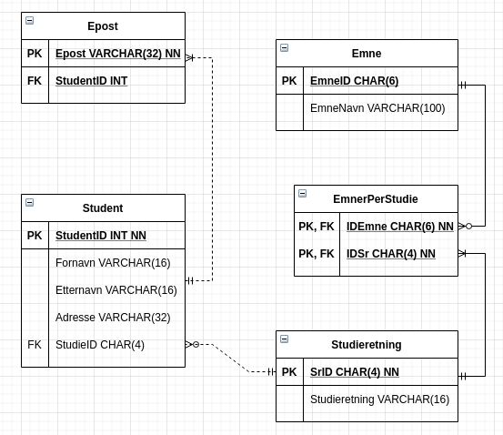

### Fra konsept til SQL

5.  Gjør om ER-modellen til en databasemodell, etter de 3 første punktene (av 6 mulige)
beskrevet i slidsene for denne økten. (Hopp over elementer du ikke klarte, og fortsett på
neste deloppgave.)

    

6.  Implementer tabellene i MySQL! (Lag en ny database/schema: hskole.)  
    `CREATE DATABASE Høyskole;`

    ```sql
    CREATE TABLE Student (
        StudentID INT PRIMARY KEY,
        Fornavn VARCHAR(16),
        Etternavn VARCHAR(16),
        Adresse VARCHAR(32),
        EpostID INT,
        SrID INT,
        FOREIGN KEY (EpostID) REFERENCES Epost(EpostID),
        FOREIGN KEY (SrID) REFERENCES Studieretning(SrID)
    );
    ```

7.  Registrer følgende emner-id /tittel: (legg gjerne til flere emner selv!)
    - DS1337 / Fett design
    - PG1011 / Binær programmering 
    - PJ1234 / Grunnleggende prosjekt