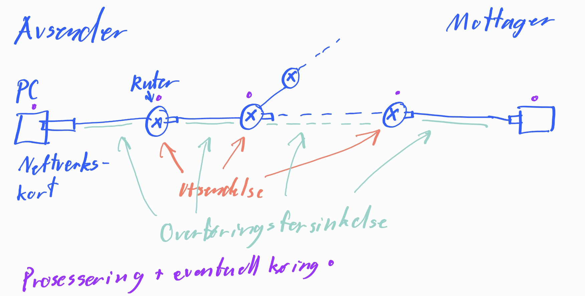

# 1. Applikasjonslaget

## a) Hva er tjenerens oppgave i klient-tjener modellen?

Tjenerens oppgave er å levere etterspurt tjenester til klienten.

## b) Hva er det en del store spill bruker for type av oppset i nettverket for å transportere informasjon? Og hva er det som er bra/dårlig med dette oppsettet?

Store spill bruker ofte P2P modellen. Ulempen med dette er pålitelighet og sikkerhet, men fordelen er at det slipper å være en sentral server som deler alle ressurser.

## c) Hvordan er det applikasjonen på maskinen (applikasjonslaget) kommuniserer med transportlaget?

Applikasjonen kommuniserer med transportlaget via Socket.

## d) Praktisk oppgave med `curl`

### - Åpne terminalen på maskinen din og skriv

### `curl -v http://www.vg.no`

### - Hva er HTTP statuskoden du får, og hva må du eventuelt gjøre for å få http statuskoden 200 OK?

Jeg får statuskoden 301 Moved. For å få statuskoden 200 OK må jeg bytte "http" til "https".

## e) Hva står UDP og TCP for, og hva er disse for noe?

UDP står for User Datagram Protocol og TCP står for Transmission Control Protocol. Disse er nettverksprotokoller som opererer på transportlaget.

## f) Tegn opp og forklar de fire ulike forsinkelse typene.

# DNS

## a) Hva står DNS for?

DNS står for Domain Name System.

## b) Hva menes med en hoved navne-tjener og TLD?

Hoved navne-tjenere er de store DNS serverene som har kun oversikt over TLD(toppnivådomenene). Det finnes 13 hoved navne-tjenere i verden, og de blir kontaktet av lokale tjenere ved behov.

## c) Hvilken default name server bruker du akkuratt nå, og hva er adressen til den?

Jeg bruker cloudflare og adressen er 1.1.1.1.

## d) Hvilke typer av spørringer finnes det når en maskin skal finne adressen gjennom en navnetjener?

Vanligvis er spørringen rekursive hvor A spør på vegne av B og returnerer svaret til B, til en lokal navnetjener. Denne typen spørring er typisk fra en bruker.

Men spørringene kan også være iterative hvor A spør på vegne av B og returnerer neste tjeners adresse til A, som deretter spør denne selv. Denne typen spørring er typisk fra lokal navnetjener til TLD og andre lokale navnetjenere.

## e) Hvorfor finnes DNS records?

Fordi det lagrer informasjon om navn og lokasjonen på domenet en bruker vil til.

# EPOST

## a) Hva er en protokoll og hva brukes SMTP protokollen til?

En protokoll er et sett av regler som tillater to eller fler enheter i et nettverk å kommunisere / overføre informasjon.

SMTP protokollen brukes til mellom tjenere for å sende epost.

## b) Hva brukes for å ta imot en epost?

Med SMTP protokollen bruker man enten POP3, IMAP eller HTTPS.

## c) For å sende en epost trengs en TCP-kobling å etableres, hva inneholder en TCP-kobling mellom en klient og tjenere?
